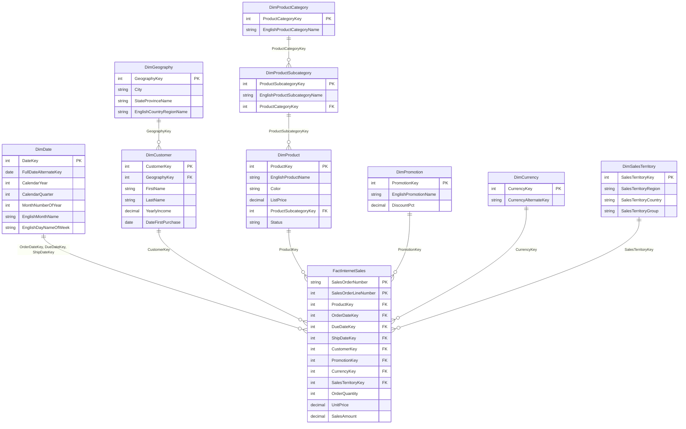
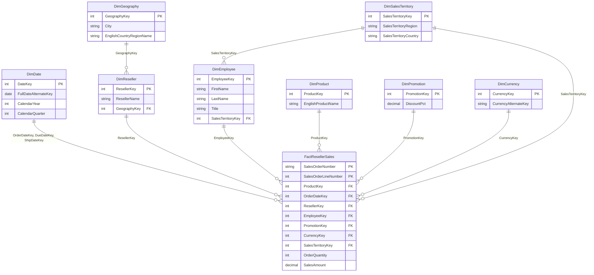
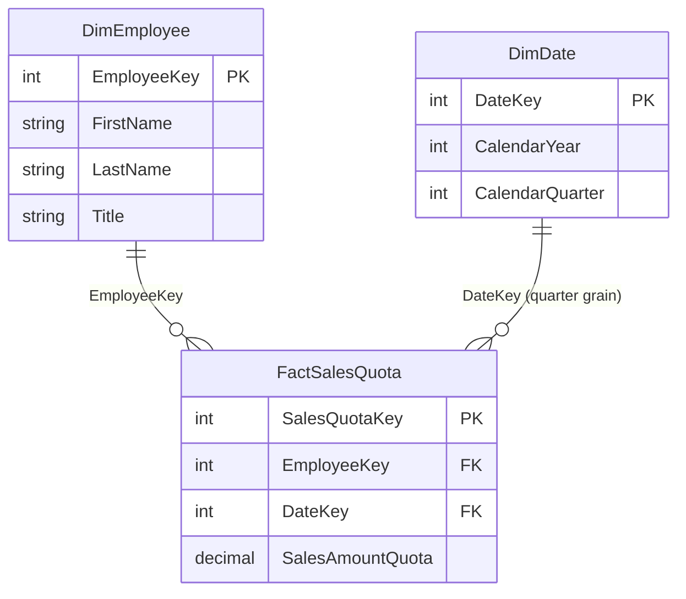
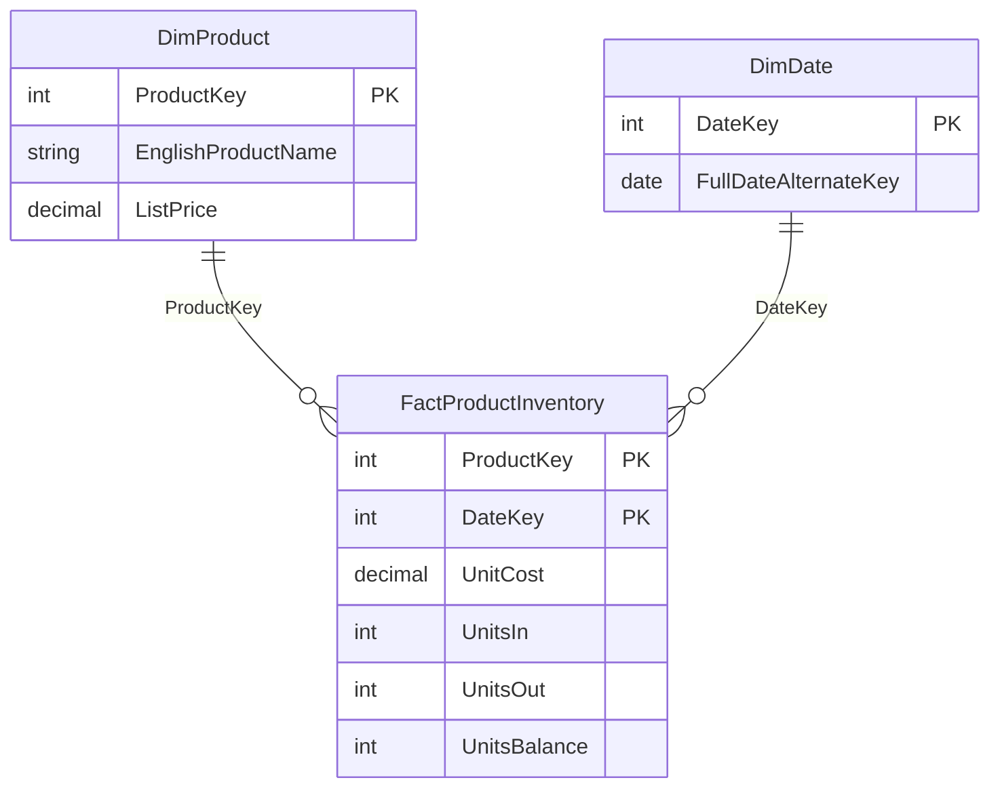

# AdventureWorksDW2025 — ER Diagram

Four star schemas for the Retail Sales Analytics project.
Read each as: **one** dimension row → **many** fact rows, joined on the labeled key.

---

## 1. Internet Sales (online orders)

Grain: one row per order line · Measures: `OrderQuantity`, `UnitPrice`, `SalesAmount`, `TaxAmt`, `Freight`

---

## 2. Reseller Sales (B2B orders)

Grain: one row per order line · Measures: `OrderQuantity`, `UnitPrice`, `SalesAmount` ·
Extra vs internet: `DimReseller` + `DimEmployee` (salesperson)

---

## 3. Sales Quota (targets)

Grain: one row per salesperson per quarter · Measure: `SalesAmountQuota` ·
Powers the quota-attainment analytics

---

## 4. Product Inventory (stock)

Grain: one row per product per day · Measures: `UnitCost`, `UnitsIn`, `UnitsOut`, `UnitsBalance` ·
Powers the slow-moving-inventory analysis

---

**Note:** the same dimension tables are reused across stars (conformed dimensions) — e.g. join
`FactInternetSales` to `DimDate` three times with different aliases when you need order date,
due date, and ship date in one query.
